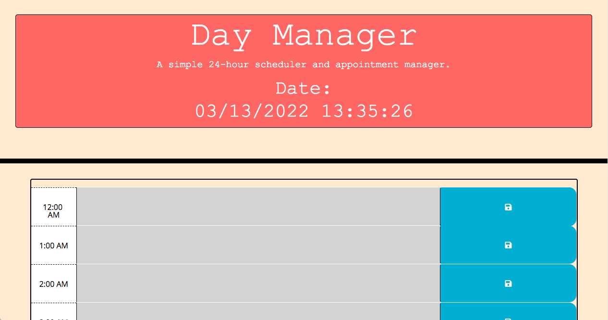
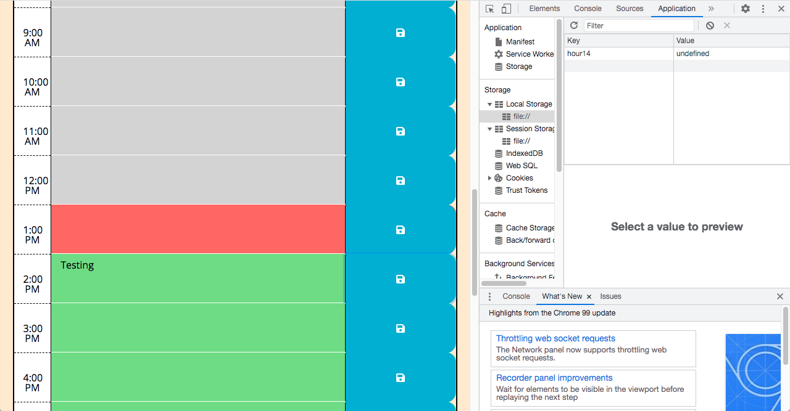
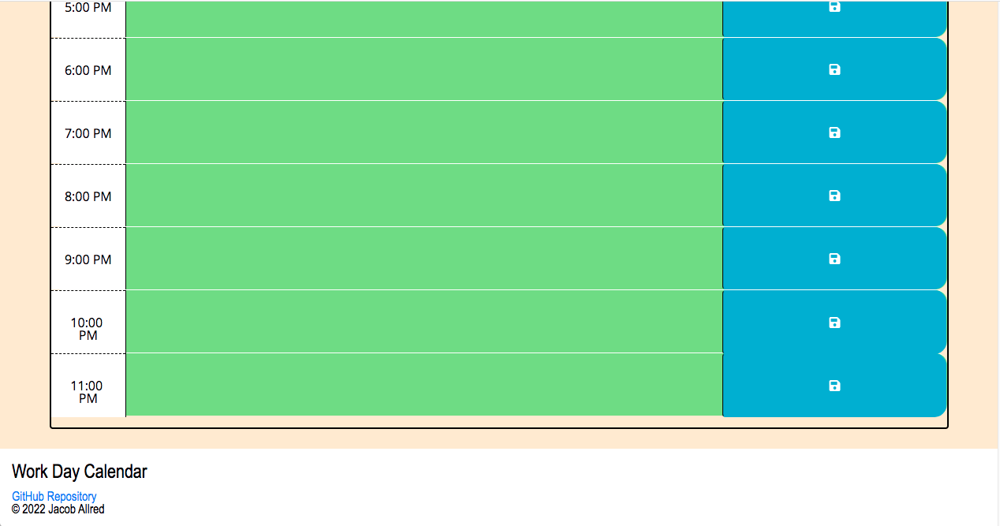

# Work-Day-Scheduler
The application is roughly ~75% complete, but there are a few things I need to fix;
My local storage is caching the text information I input, but it is not saving the exact value. (See Screenshot Below)
The text is not persisting when the page is refreshed. (Currently trying to fix)

Having recently completed the Code Quiz for Module 4, completing this Module 5 challenge did not prove to be as headache-inducing as some other challenges. I am still not very comfortable with JQuery. I do understand that it is essentially a cleaner, simpler way to condense your JavaScript.

Having used many references from the internet and essentially triple checking every function along the way, I still have a far ways to go when it comes to getting comfortable writing JQuery. 

This application uses Moment.js to handle the time. 

Deployed URL: https://yourfunkydad.github.io/Work-Day-Scheduler/

GitHub Repository: https://github.com/YourFunkyDad/Work-Day-Scheduler

Main Page:

Local Storage Cache:

Main Page Footer:
